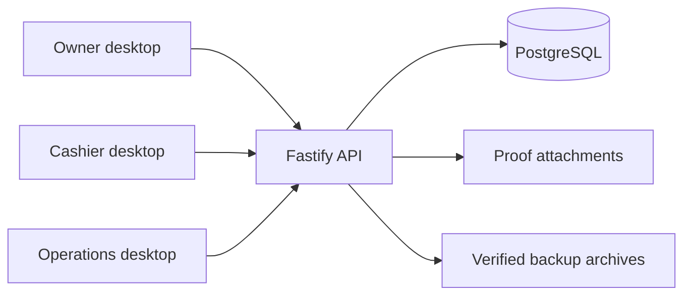

# BCIS requirements and implementation decisions

Source: BCIS_Subscription_Billing_and_Collection_Laboratory_Activity.pdf, 17 pages. The PDF is the requirements specification; its recommendations for AI prompts and classroom checkpoints are not runtime application behavior.

## Architecture

Three Electron clients communicate with one Fastify API over the office LAN. PostgreSQL and attachments live on the server. No client has database credentials. React is a presentation layer; transactional services own financial rules.

## Financial policy

- Money is submitted and stored as integer centavos. Forms accept decimal strings, parsed without floating-point multiplication. An individual posted amount is limited to 999,999,999,999 centavos.
- Monthly invoices use the service account's agreed rate. A plan price change cannot rewrite invoices. Updating a plan does not automatically change an existing negotiated service rate.
- One invoice per service and calendar month; billing starts in the month of the billing-start date. Full-month billing, no automatic proration. Billing and due days are limited to 1–28 to eliminate invalid calendar dates.
- Oldest billing period, then invoice ID, is the allocation order. Manual allocation is intentionally disabled under this policy.
- Excess payment stays as unallocated credit belonging to the subscriber. Future billing applies it automatically, including across the subscriber's service accounts.
- Subscriber row locks serialize financial activity on one subscriber. Transactions encompass payments, allocations, invoices, and audit entries. Different subscribers can be processed concurrently.
- Payment idempotency keys protect network retries. Database sequences produce unique invoice and receipt numbers; gaps are allowed and numbers are never reused.
- GCash references are normalized to uppercase and uniquely indexed. Recording/uploading evidence does not post money. Authorized verification of a pending proof atomically posts the payment. Staff must independently check the business GCash history.
- Reversals preserve the original payment, receipt, and allocations. Balance calculations exclude reversed allocations, and the ledger records an offsetting debit. A submitted batch payment cannot be reversed without a separate accounting correction; reopen is intentionally not automatic.
- Invoice adjustments preserve the original amount. Credits cannot go below the already allocated amount. Voiding requires no active allocations and records an offsetting credit. The unique billing period remains reserved after voiding.
- Cash remittance compares actual remitted cash with posted, non-reversed batch Cash payments. Non-cash is separately displayed. Difference = remitted minus expected Cash. Negative means shortage. Reconciliation and closure require explicit authorized reason; the recorded difference remains visible.
- Ledger debit/credit rows are reconstructed from immutable invoices, adjustments, payments, and reversals. Opening balance is included in date-filtered SOA exports.
- AR aging uses invoice due dates as of the database date. Collection summaries exclude reversals, while reversal reports preserve corrections. These are operational collection reports, not statutory tax invoices or formal general-ledger accounting.

## Security

Passwords use salted scrypt hashes. Sessions store only token hashes, expire after eight hours, and remain in renderer memory rather than browser local storage. Login rate limiting restricts repeated attempts. Deactivated users lose sessions. Every protected request reloads active user and role permissions from PostgreSQL.

Electron uses context isolation, a sandbox, no renderer Node integration, navigation blocking, and a typed API-only preload bridge. No shell execution or filesystem API is exposed to the renderer. Proof uploads accept JPEG/PNG signatures, limit size to 5 MB, and use generated server filenames. Proof viewing requires verification permission.

Audit, reversal, remittance, and adjustment history is append-only through database triggers. Financial facts are protected from destructive edits. Database administrative access remains a privileged operational responsibility; keep database ports and credentials off client PCs.

## Technology choices

The required architecture is followed: Electron, React, strict TypeScript, Fastify, PostgreSQL, and Zod. SQL migrations and parameterized PostgreSQL queries make row locking and financial constraints explicit; a Drizzle connection is available but ORM schema generation is not used. Vite + esbuild build the renderer and desktop shell. The UI uses custom CSS and accessible native controls instead of Tailwind/shadcn. Reports use ExcelJS and PDFKit. These are deliberate deviations from the PDF's *recommended* libraries, not from its mandatory client/server architecture.

## Completion evidence

Consult `tests/acceptance-status.md` for executed results and remaining deployment checks. A local build or three concurrent API requests is not evidence that a Windows installer was installed on three physical PCs. No production or real subscriber data is included.

## Dependency audit (9 October 2026)

The final production dependency audit reports zero known vulnerabilities. Drizzle, Vitest and transitive packages were updated; ExcelJS's UUID dependency is overridden to patched UUID 11, with PDF/XLSX generation rechecked. The full development dependency audit retains eight moderate findings along Electron Builder's download/logging chain (sprintf-js → roarr → global-agent). No high or critical findings remain. These packages are build tooling, not the server's runtime dependency set. The exact audit JSON is retained under tests/; recheck before future releases.
